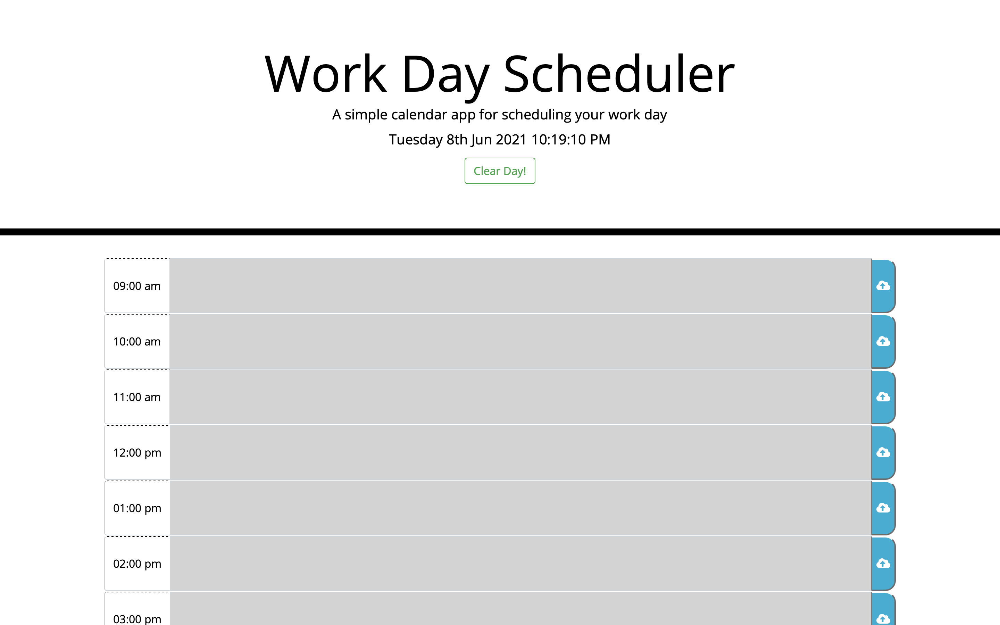
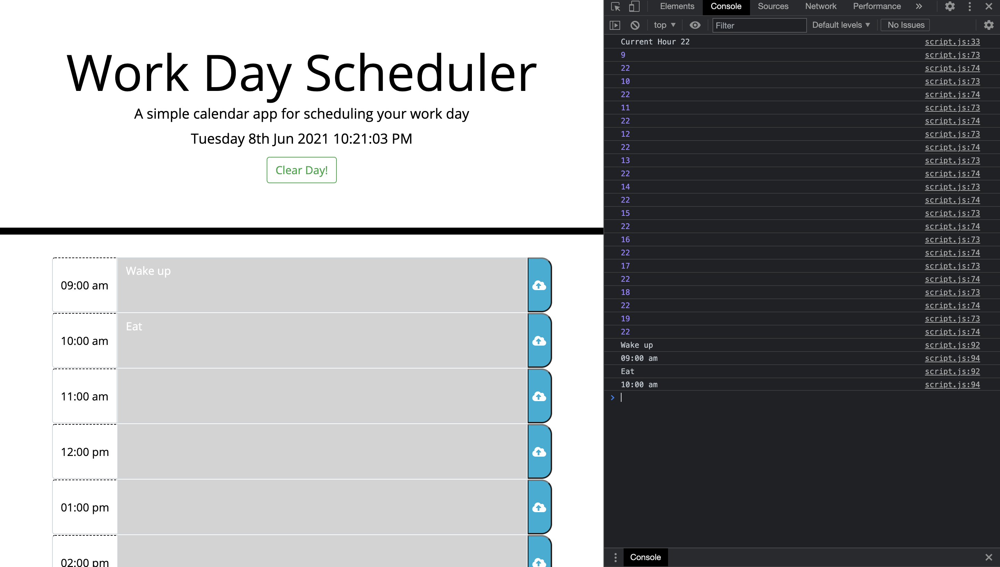

# Work-Day-Scheduler

## Description 
    The work day scheduler allows you to create a schedule for each hour in a day between 9am and 7pm. 
    The application features dynamically updated HTML and CSS powered by jQuery and is Utilizing API moment.js.

## Link to Application
The Work Day Scheduler is currently hosted by GitPages from a GitHub repository.

[Click here to see the deployed application!](https://gavinreid0.github.io/Work-Day-Scheduler/)

## Installation
To install this to your computer simply click the green 'code' button on the github repository. You can pull from gitlab by copying either the HTTPS or SSH link and creating a clone in your terminal (use 'git clone')!

## Usage
* Plan your day by typing your schedule into the correct time slot
* To log an event simply click the cloud icon on the right of the input box

The following image shows the web application's apperance and functionality:

